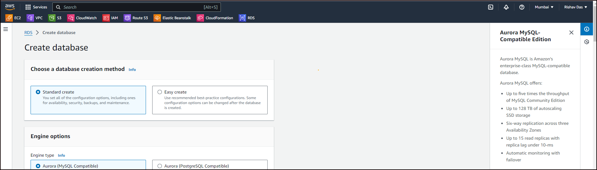
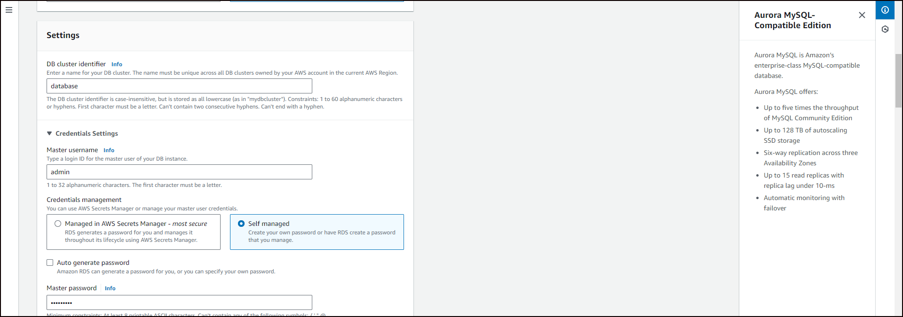
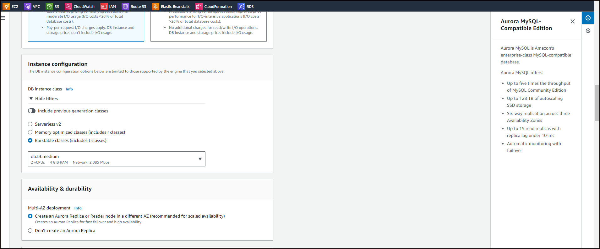
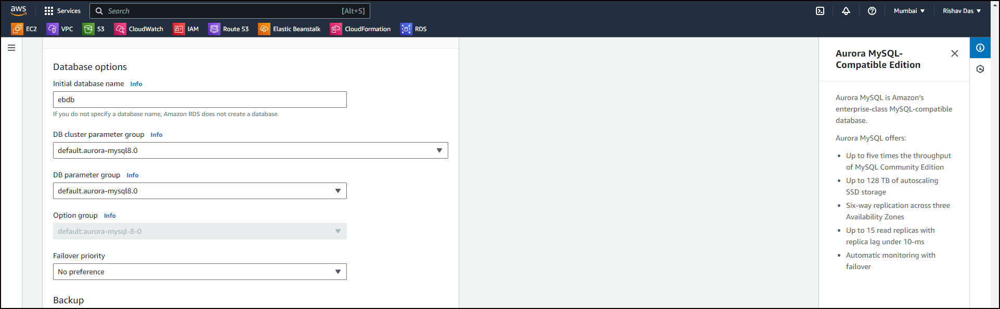
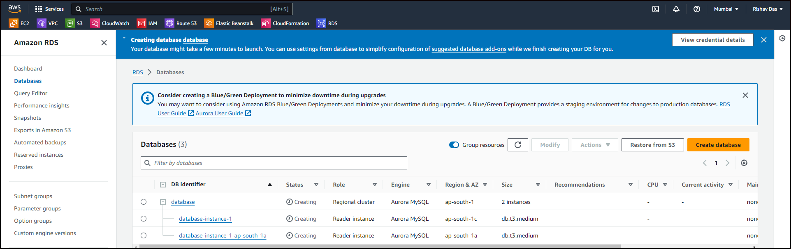
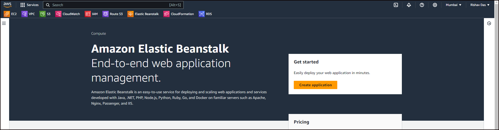
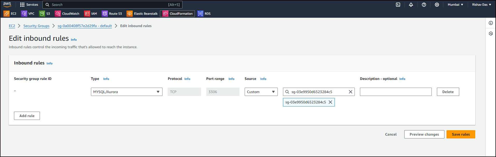
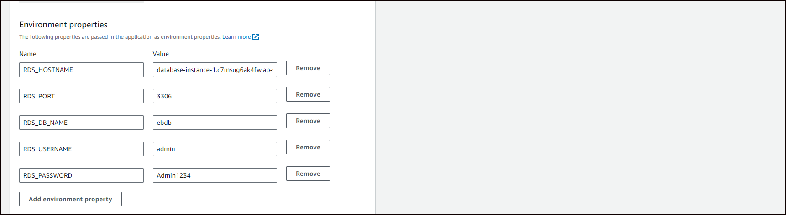
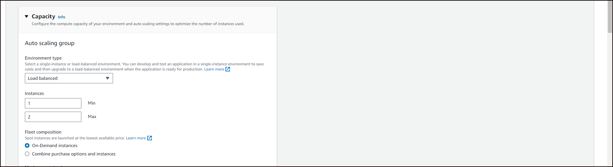

# Deploying a high-availability WordPress website with an external Amazon RDS database to Elastic Beanstalk

## Launch a MySql DB instance

- **Open the RDS console.**
- **In the navigation pane, choose Databases.**
- **Choose Create database.**
- **Choose Standard Create.**
- **Under Additional configuration, for Initial database name, type ebdb.**

Review the default settings and adjust these settings according to your specific requirements.

# Launch an Elastic Beanstalk environment

- **Open the Elastic Beanstalk console**

## To modify the ingress rules on your RDS instance's security group

## To configure environment properties for an Amazon RDS DB instance:

