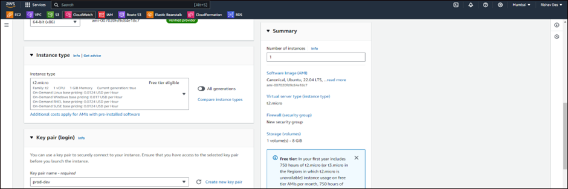
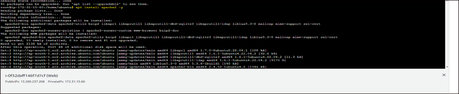
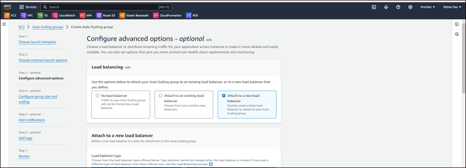

# Capstone Project - 1: Deploying a Multi-Tier Website Using AWS EC2

## Step:1 Create a EC2 Instance. 

## Step 2: Select the instance type and key-pair. 

## Step:3: Create a security group allow ssh, http and https. 

## Step:4 Login to the EC2 instance and update the machine. 

## Step:5 Install apache2 web server. 

## Step:6 Add the php repository. 

## Step:7 Install php and mysql-client. 

## Step:8 Navigate to RDS and create a database. 

## Step:9 Select standard create and MySql engine. 

## Step:10 Select Free tier and provide a name of db instance. 

## Step:11 Select public access as ‘yes’ in this case. 

## Step:12 Provide initial database name and leave rest as default.
 

## Step:13 In database security group add a rule that accepts requests from security group of EC2 instances on port 3306. 

## Step:14 After creation of database login to ec2 instance and try to access the database. 

## Step:15 Check if data is present in the database. 

## Step: 16 Now navigate to /var/www/html and create two files as shown below.
 

## Step:17 Type this content in the index.html as shown below. 

## Step:18 Type this content in the insert_students.php as shown below. 

## Step:19 After that start the apache2 server. You will find this form. 

## Step:20 Fill some data in the form. 

## Step:21 You can see record has been successfully created. 

## Step:22 Now check the data in the intel table which we created. You can clearly see the data has been populated in the table. 

## Step:23 Next we will create image the of the server. 

## Step:24 provide name and all other details. 

## Step:25 Next, we will create a launch template for autoscaling, enter all the details required. 

## Step:26 Now we will create Autoscaling group and we will also create load balancer in the same step. For ASG minimum instances will be 2. 

 
 
 

## Step:27 Final output. 

