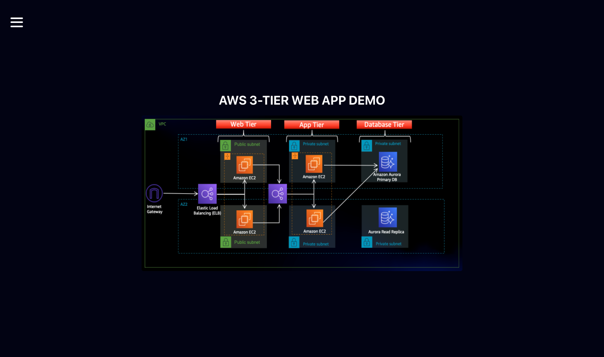
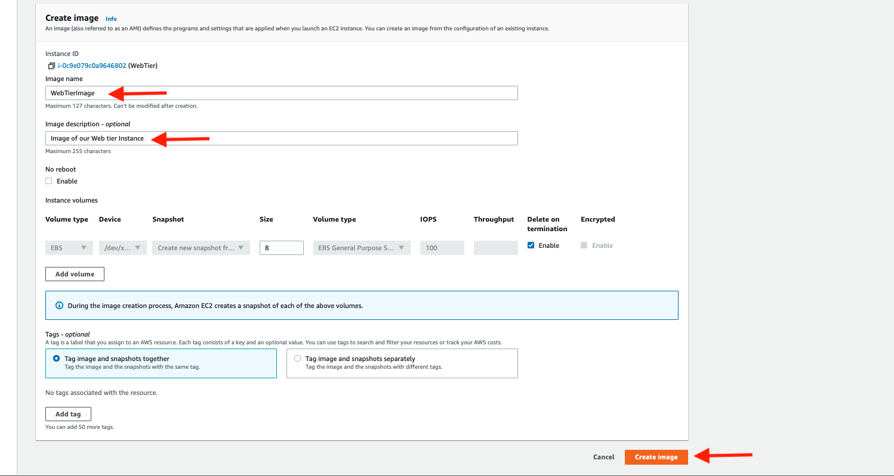
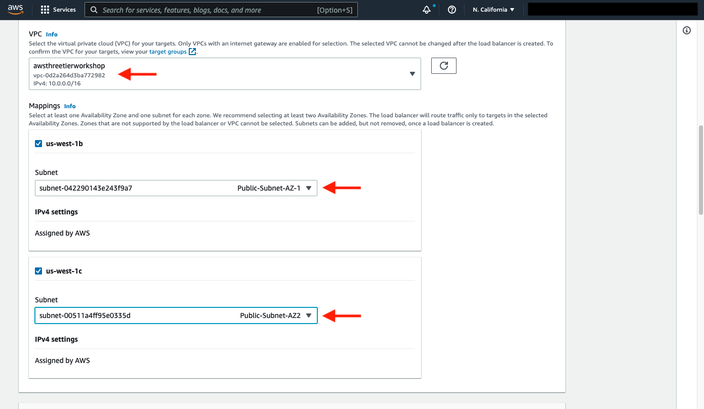

# Problem Statement

**Create a three tier architecture where a public-facing Application Load Balancer forwards client traffic to our web tier EC2 instances. The web tier is running Nginx web servers that are configured to serve a React.js website and redirects our API calls to the application tier’s internal facing load balancer. The internal facing load balancer then forwards that traffic to the application tier, which is written in Node.js. The application tier manipulates data in an Aurora MySQL multi-AZ database and returns it to our web tier. Load balancing, health checks and auto scaling groups are created at each layer to maintain the availability of this architecture.**


## VPC And Networking Setup

**Create a VPC, make sure VPC only is selected, and fill out the VPC Settings with a Name tag and a CIDR range of your choice.**
```
10.0.0.0/16
```


**Create 6 subnets three in each ap-south-1a and ap-south-1b**


 

**Six subnets are:-**
```
Public-Web-Subnet-AZ-1 - 10.0.0.0/24
Public-Web-Subnet-AZ-2 - 10.0.1.0/24
Private-App-Subnet-AZ-1  - 10.0.2.0/24
Private-App-Subnet-AZ-2 - 10.0.3.0/24
Private-DB-Subnet-AZ-1 - 10.0.4.0/24
Private-DB-Subnet-AZ-2 - 10.0.5.0/24
```
**Then we create a internet gateway and attach it to VPC**


**Navigate to Route Tables and  click Create route table, let’s create one route table for the web layer public subnets and name it accordingly.**


**Then edit routing config and add internet gateway route** 

 

**After that add the public subnets to the route table**


**Note:** Similarly create route table for private subnet and add private app subnets to it.

**We will now create 5 security groups**

**"internet-facing-lb" security group and add inbound rule HTTP port 80**

 

**"WebTierSG" security group and add inbound rule HTTP port 80 from "internet-facing-lb" security group**

 

**"internal-lbsg" security group and add inbound rule HTTP port 80 from "WebTierSG" security group**

 

**"privateinstacesg" security group and add inbound rule Custom TCP port 4000 from "internal-lbsg" security group**


**"DBSG" security group and add inbound rule TCP port 3306 from "privateinstacesg" security group**

 

**Create a NAT gateway and add the route to private routing table**


## Database Setup 

**Navigate to the RDS dashboard in the AWS console and click on Subnet groups on the left hand side. Click Create DB subnet group.**

 

**Provide group name and select vpc and db subnets**


**Navigate to Databases on the left hand side of the RDS dashboard and click Create database.**

 

**Select standard create and select MySQL-Compatible Amazon Aurora then select Dev/Test under the templates**


**Selct the my-vpc which we created and select the db subnet group**


**Choose the instance type and select reader node in different az and then click on create**


# App Tier Setup

**Go to Launch instances and launch an EC2**


**Select my-vpc and private subnet 1 also select privateinstancesg security group and then click on create**


**Create a Bastion host in the public subnet with all traffic enabled. This is required to connect to other instances**


**Connect to the Bastion host and from there go to the app tier instance.**

 
 
 
 

**Install the mariadb105-server on the app instance.**
```
sudo yum install mariadb105-server -y
```
 

**Then connect to database using endpoint.**
```
mysql -h CHANGE-TO-YOUR-RDS-ENDPOINT -u CHANGE-TO-USER-NAME -p
```
 

**Create a database called webappdb**
```
CREATE DATABASE webappdb;   
```
**You can verify that it was created correctly**
```
SHOW DATABASES;
```
**Create a data table:**
```
USE webappdb;    
```
 

**Then, create the following transactions table by executing this create table command:**
```
CREATE TABLE IF NOT EXISTS transactions(id INT NOT NULL
AUTO_INCREMENT, amount DECIMAL(10,2), description
VARCHAR(100), PRIMARY KEY(id));    
```
**Verify the table was created:**
```
SHOW TABLES;
```

**Insert data into table for testing later:**
```
INSERT INTO transactions (amount,description) VALUES ('400','groceries');   
```

**Verify that your data**
```
SELECT * FROM transactions;
```

 

**We will create a S3 bucket which will contain configuration**


**Create a role and attach S3ReadOnlyRole and Ec2ManagedInstanceCore permission to it.**

 

**The first thing we will do is update our database credentials for the app tier. To do this, open the application-code/app-tier/DbConfig.js file from the github repo. Fill this in with the credentials, the writer endpoint of the database as the hostname, and webappdb for the database. Save the file.**


**Now move to the app instance and run th following commands for setup**

```
curl -o- https://raw.githubusercontent.com/nvm-sh/nvm/v0.38.0/install.sh | bash
source ~/.bashrc
```
Next, install Node.js and make sure it's being used
```
nvm install 16
nvm use 16
```
PM2 is a daemon process manager that will keep our node.js app running when we exit the instance or if it is rebooted. Install that as well.
```
npm install -g pm2   
```
Now we need to download our code from our s3 buckets onto our instance. In the command below, replace BUCKET_NAME with the name of the bucket you uploaded the app-tier folder to:
```
cd ~/
aws s3 cp s3://BUCKET_NAME/app-tier/ app-tier --recursive
```
Navigate to the app directory, install dependencies, and start the app with pm2.
```
cd ~/app-tier
npm install
pm2 start index.js
```
To make sure the app is running correctly run the following:
```
pm2 list
```
If you see a status of online, the app is running. If you see errored, then you need to do some troubleshooting. To look at the latest errors, use this command:
```
pm2 logs
```

Right now, pm2 is just making sure our app stays running when we leave the SSM session. However, if the server is interrupted for some reason, we still want the app to start and keep running. This is also important for the AMI we will create:
```
pm2 startup
```
After running this you will see a message similar to this.

[PM2] To setup the Startup Script, copy/paste the following command: 
```
sudo env PATH=$PATH:/home/ec2-user/.nvm/versions/node/v16.0.0/bin /home/ec2-user/.nvm/versions/node/v16.0.0/lib/node_modules/pm2/bin/pm2 startup systemd -u ec2-user —hp /home/ec2-user
```
After that, save the current list of node processes with the following command:
```
pm2 save
```
**Now let's run a couple tests to see if our app is configured correctly.**

**To hit out health check endpoint**
```
curl http://localhost:4000/health
```
**The response should looks like the following:**
```
"This is the health check"
```
**Next, test your database connection**
```
curl http://localhost:4000/transaction
```
You should see a response containing the test data we added earlier:
```
{"result":[{"id":1,"amount":400,"description":"groceries"},{"id":2,"amount":100,"description":"class"},{"id":3,"amount":200,"description":"other groceries"},{"id":4,"amount":10,"description":"brownies"}]}
```
**If you see both of these responses, then your networking, security, database and app configurations are correct.**

# Internal Load Balancing and Autoscaling

**Select the AppServer then go to actions then image then click on create image.**

 

**Provide image name and click on create.**


**Go to EC2 dashboard navigate to Target Groups under Load Balancing, Click on Create Target Group.**

 

**Choose type as instances, provide group name then select port 4000 and protocol HTTP and health path as /health and click on create.**


**On the left hand side of the EC2 dashboard select Load Balancers under Load Balancing and click Create Load Balancer.**


**Select the application load balancer here**


**Provide load balancer name, then check the scheme as internal then select VPC and select the private subnets, also select the seurity group as internal-lb-sg which we created earlier.**


**Next create a launch template**

 

**Choose the AMI that we created earlier.**

 

**Select insance type and select the IAM role also**


**Go to EC2 dashboard navigate to Auto Scaling Groups under Auto Scaling and click Create Auto Scaling group.**


**Give Auto Scaling group a name, and then select the Launch Template we created and click next.**


**Select the VPC and choose the private subnets, and click on next.**


**Attach this Auto Scaling Group to the Load Balancer we just created by selecting the existing load balancer's target group from the dropdown. Then, click next.**


**For Configure group size and scaling policies, set desired, minimum and maximum capacity to 2. Click skip to review and then Create Auto Scaling Group.**


# Web Tier Instance Setup

**Before we create and configure the web instances, open up the application-code/nginx.conf file from the repo we downloaded. Scroll down to line 58 and replace [INTERNAL-LOADBALANCER-DNS] with internal load balancer’s DNS entry.**

**Then, upload this file and the application-code/web-tier folder to the s3 bucket.**


**Create a web instance, provide name and select AMI.**


**Select the security group and keypair and IAM profile and click on create.**
 


**Connect to EC2 and run following commands.**

**We need to install all of the necessary components needed to run our front-end application. Again, start by installing NVM and node :**

```
curl -o- https://raw.githubusercontent.com/nvm-sh/nvm/v0.38.0/install.sh | bash
source ~/.bashrc
nvm install 16
nvm use 16
```

**Then download our web tier code from our s3 bucket:**
```
cd ~/
aws s3 cp s3://BUCKET_NAME/web-tier/ web-tier --recursive
```

**Navigate to the web-layer folder and create the build folder for the react app:**
```
cd ~/web-tier
npm install 
npm run build
```

**Install NGINX.**
```
sudo amazon-linux-extras install nginx1 -y
```

**Navigate to the Nginx configuration file with the following commands and list the files in the directory:**
```
cd /etc/nginx
ls
```

**You should see an nginx.conf file. We’re going to delete this file and use the one we uploaded to s3. Replace the bucket name in the command below with the one you created for this workshop:**
```
sudo rm nginx.conf
sudo aws s3 cp s3://BUCKET_NAME/nginx.conf .
```

**Then, restart Nginx with the following command:**

```
sudo service nginx restart
```

**To make sure Nginx has permission to access our files execute this command:**

```
chmod -R 755 /home/ec2-user
```

**And then to make sure the service starts on boot, run this command:**

```
sudo chkconfig nginx on
```
**Now when you type in the public IP of your web tier instance, you should see your website.**

 


# External Load Balancer and Auto Scaling

**Navigate to Instances. Select the web tier instance we created and under Actions select Image and templates. Click Create Image.**


**Give the image a name and description and then click Create image.**



**Create a target group to use with the load balancer.**


**Select Instances as the target type and give it a name.**

 

**Then, set the protocol to HTTP and the port to 80 and change the health check path to be /health.**


**We are NOT going to register any targets for now**

 

**Go to EC2 dashboard select Load Balancers under Load Balancing and click Create Load Balancer.**


**We'll be using an Application Load Balancer for our HTTP traffic**

 

**After giving the load balancer a name, select internet facing**

 

**Select the correct network configuration for VPC and public subnets**



**Select the security group we created for this ALB.**

 

**we need to create a Launch template with the AMI we created earlier.**


**Name the Launch Template, and then under Application and OS Images include the app tier AMI.**

 

**Under Instance Type select t2.micro. For Key pair and Network Settings don't include it in the template.**

 

**Set the correct security group for our web tier, and then under Advanced details use the same IAM instance profile we have been using for our EC2 instances.**

 

 

**We will now create the Auto Scaling Group for our web instances.**

 

**Give Auto Scaling group a name, and then select the Launch Template we just created and click next.**

 

**On the Choose instance launch options page set your VPC, and the public subnets for the web tier**

 

**attach this Auto Scaling Group to the Load Balancer we just created**

 

**For Configure group size and scaling policies, set desired, minimum and maximum capacity to 2. Click skip to review and then Create Auto Scaling Group.**

 

**Now the task is completed we can now visit the application by providing DNS of external load balancer**

**Reference: https://catalog.us-east-1.prod.workshops.aws/workshops/85cd2bb2-7f79-4e96-bdee-8078e469752a/en-US**

